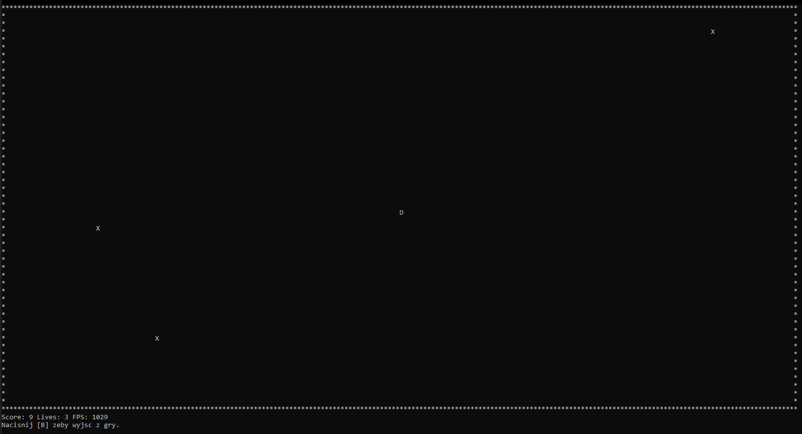

<div align="justify">

# Zręcznościowa Gra Konsolowa Sterowana Kontrolerem HID

## Opis Projektu
Niniejszy projekt stanowi implementację prostej gry zręcznościowej uruchamianej w środowisku konsoli systemu Windows. Rozgrywka osadzona jest w świecie o ściśle określonych granicach, wewnątrz którego przemieszcza się kontrolowana postać, zmuszona do unikania nadciągających przeciwników. Od strony technicznej, celem oprogramowania jest demonstracja asynchronicznego odczytu danych z urządzeń wejściowych, a następnie ich precyzyjnej integracji z silnikiem logicznym gry oraz wysokowydajnym modułem renderującym znaki w oknie terminala.

## Zasady Gry i Wymagania Sprzętowe
Podstawowym celem zabawy jest przetrwanie najdłuższego możliwego czasu na planszy, poprzez płynne manewrowanie postacią w obrębie wyznaczonych granic i zapobieganie kolizjom. Niezbędnym wymogiem sprzętowym do poprawnego uruchomienia i obsługi aplikacji jest posiadanie kompatybilnego kontrolera gier (pada), komunikującego się z systemem poprzez protokół HID (Human Interface Device). Klasyczny interfejs klawiatury nie jest obsługiwany w zakresie sterowania bohaterem.

## Przykładowy Zrzut Ekranu


## Sposób Uruchomienia
W celu kompilacji oraz uruchomienia programu, wymagane jest środowisko programistyczne wspierające język C++ (np. narzędzia MSVC lub MinGW) oraz system budowania CMake. Dostępne są dwa warianty procesu budowania:

### Zautomatyzowany skrypt wsadowy
Najprostsza metoda polega na wywołaniu dedykowanego skryptu. Należy:
1. Uruchomić wiersz poleceń (cmd) lub program PowerShell w głównym katalogu projektu.
2. Wykonać polecenie: `build.bat`
Skrypt automatycznie skonfiguruje projekt, przeprowadzi kompilację kodu źródłowego, a w przypadku sukcesu – natychmiastowo uruchomi plik wykonywalny.

### Manualna kompilacja przy użyciu CMake
W środowiskach, w których użycie skryptu wsadowego nie jest możliwe lub optymalne, dopuszcza się bezpośrednie wykorzystanie narzędzia CMake w procesie budowania:
1. Uruchomić wiersz poleceń w głównym katalogu projektu.
2. Wygenerować pliki systemowe budowania w dedykowanym katalogu `build`:
   ```shell
   cmake -B build
   ```
3. Przeprowadzić kompilację, preferencyjnie w trybie wydajnościowym (Release):
   ```shell
   cmake --build build --config Release
   ```
4. Po udanym procesie budowania, wygenerowany plik wykonywalny `game.exe` (lub tożsamy dla danego środowiska) zostanie umieszczony wewnątrz katalogu `build` (ewentualnie w podkatalogu `build/Release` w przypadku kompilatora MSVC).

## Spis Technologii
* **Język programowania:** C++ (Standard C++17)
* **System budowania:** CMake
* **Biblioteki systemowe (Windows API):**
  * `hid.lib`, `setupapi.lib` – do obsługi komunikacji sprzętowej na poziomie protokołu HID.
  * `windows.h` – wykorzystywana do zarządzania wielowątkowością, synchronizacją zasobów oraz wysoce wydajnej obsługi wyświetlania w konsoli (m.in. za pomocą funkcji `WriteConsoleA`).

## Konstrukcja Aplikacji
Architektura oprogramowania została podzielona na niezależne moduły, co pozwala na separację obaw i ułatwia rozwój kodu. Wyróżnia się następujące przestrzenie:
* **Core (Rdzeń):** Moduł odpowiadający za główną pętlę programu, zarządzanie cyklem życia aplikacji oraz przechowywanie globalnego stanu gry.
* **Input (Wejście):** Moduł realizujący asynchroniczne połączenie z kontrolerem HID. Wykorzystuje maski bitowe do precyzyjnego dekodowania sygnałów wciśniętych przycisków w obrębie dedykowanego wątku.
* **Graphics (Grafika):** Niskopoziomowy komponent odpowiedzialny za pobieranie bufora klatek i jego renderowanie bezpośrednio do standardowego wyjścia konsoli przy maksymalnym ograniczeniu narzutu wydajnościowego.
* **Entities (Byty gry):** Zbiór klas reprezentujących logikę poszczególnych obiektów występujących w przestrzeni gry (np. menedżer przeszkód).
Komunikacja pomiędzy poszczególnymi zadaniami (wątek logiki, renderowania oraz kontrolera) jest precyzyjnie synchronizowana za pomocą mechanizmów blokad (mutex).

## Ograniczenia
* Program został zoptymalizowany i dostosowany wyłącznie do działania w środowisku systemu operacyjnego Microsoft Windows (z uwagi na ścisłe powiązanie bibliotek graficznych i wejściowych z Windows API).
* Obsługa urządzeń wejściowych jest przypisana do określonego identyfikatora sprzętowego kontrolera HID. Użycie innego urządzenia sterującego wymaga rekonfiguracji parametrów VID (Vendor ID) oraz PID (Product ID) bezpośrednio w kodzie źródłowym.
* Płynność i jakość renderowania są ściśle uzależnione od używanego emulatora terminala. Rekomendowane jest natywne okno konsoli Windows (conhost.exe) lub nowoczesny Windows Terminal, by uniknąć spadków płynności odświeżania obrazu.

</div>
